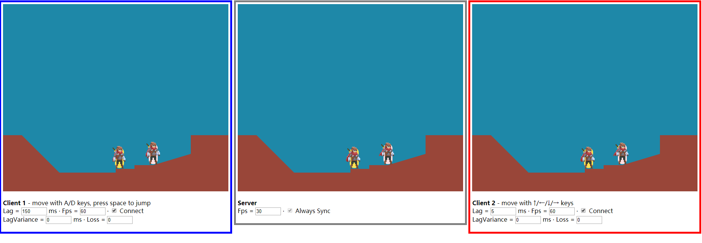

# CharacterMovement
> a 2d capsule based character movement implement demo.



## Prerequisites
> nodejs & npm

## Build & Run

### 1. Install development dependencies
```sh
npm install
```
### 2. Build the project
only build the code
```sh
npm run build
```
or start a development environment
```sh
npm run dev
```
### 3. Try it
> open the public/index.html or navigate to [localhost:5000](http://localhost:5000)

## What it is
> It is a demo project, implement 2d capsule based character movement.

## What it is not
> It is not a library, so it will hard to direct use it in other project.

## Debug Console
|    Console Vars     | Description                   |
| :-----------------: | :---------------------------- |
|     Time.scale      | (0-1), scale time             |
| Debug.showDebugDraw | (true,false), show move infos |

## Todo list
- [x] Walking
- [x] Walking slope
- [x] Step up stairs
- [x] Falling
- [x] Jumping
- [ ] Animation (WIP)
- [ ] Improve robustness
- [ ] Network multiplayer

## License
This project is licensed under the MIT License - see the **LICENSE** file for details

## Reference
UE4 CharacterMovement

[https://gafferongames.com/post/state_synchronization/](https://gafferongames.com/post/state_synchronization/)

[http://www.gabrielgambetta.com/client-server-game-architecture.html](http://www.gabrielgambetta.com/client-server-game-architecture.html)

## Credits
Test animation sprites come from [Animated Pixel Adventurer](https://rvros.itch.io/animated-pixel-hero)